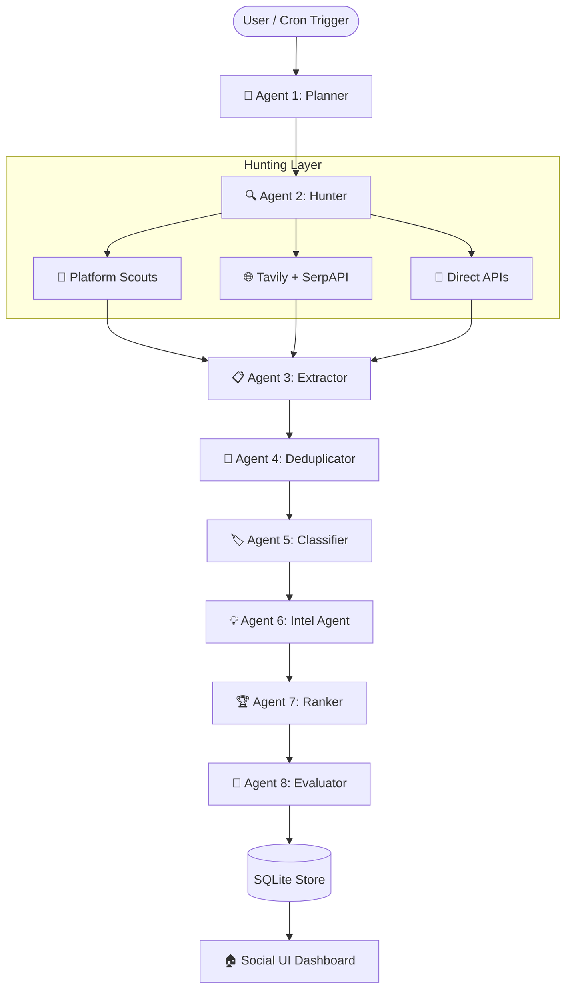

# 🚀 OpportunityOS AI — Autonomous Multi-Agent Discovery Engine

OpportunityOS AI is a high-volume, self-scheduling, personalized multi-agent pipeline designed to discover, evaluate, and match developer and student opportunities (hackathons, fellowships, internships, open source programs) from across the internet. 

Powered by **Gemini 2.5 Flash** and built with **LangGraph**, it serves as an autonomous background analyst that runs checks, scrapes pages, searches the web, and pairs opportunities directly to your Resume, GitHub repos, and LinkedIn profile.

---

## ⚡ Key Hackathon-Winning Features

### 1. 🕒 Self-Scheduling Background Agent
* Runs silently in an asynchronous background thread inside Streamlit.
* Executes **3x daily runs (every 8 hours)**.
* Persists historical runs and outputs in a SQLite database to prevent redundant API queries.

### 2. 🎯 Personalized Resume Matchmaker (Evaluator Agent)
* Ingests your skills in multiple ways: **Upload a PDF Resume**, enter a **GitHub Username**, or paste a **LinkedIn Bio**.
* Synthesizes inputs into a unified candidate schema (`core/profile_extractor.py`).
* Runs a specialized **Evaluator Agent** that assigns a personalized Match Score (0–100%) and generates feedback detailing candidate-fit.

### 3. 🔍 Direct Application Link Scouts
* Employs platform-specific scouts (e.g. `devfolio_scout.py`, `unstop_scout.py`) that bypass JS gates to fetch direct application links.
* Employs a **Deep Link Resolver Agent** (`deep_link_resolver.py`) that uses Firecrawl to visit surface search results, trace DOM structures, and parse "Apply Now" buttons automatically.

### 4. 🎛️ Social Feed Exploratory UI
* Redesigned using a modern **3-column social feed layout** (Hakku inspired).
* Search and horizontal category pills let users explore opportunities fluidly.
* Built-in **Bookmarks system** that persists saves straight to SQLite.

---

## 🏗️ Multi-Agent Architecture (LangGraph Flow)



---

## 🚀 How to Run the Project

### 1. Prerequisites & Installation
Ensure you have Python 3.10+ installed.

```bash
# Clone the repository and navigate to root
cd "OpportunityOS AI"

# Install requirements
pip install -r requirements.txt
```

### 2. Set Up API Credentials
Create a `.env` file in the root directory:

```env
# Required for Agents LLM
GOOGLE_API_KEY=your_gemini_api_key

# Optional (Enables Web Crawling & Google Search)
FIRECRAWL_API_KEY=your_firecrawl_api_key
TAVILY_API_KEY=your_tavily_api_key
SERPAPI_KEY=your_serpapi_google_key
```

### 3. Verify Setup & Run Tests
We provide automated diagnostic and unit-test scripts to make grading straightforward:

```bash
# Run environment diagnostics
python setup_check.py

# Run unit test suite
python -m unittest tests/test_mock_pipeline.py
```

### 4. Start the Application
Launch the Streamlit interface:

```bash
streamlit run app.py
```
Open [http://localhost:8501](http://localhost:8501) in your browser.

---

## 📁 Repository Structure
* `/agents`: The 8 specialized agents comprising the pipeline.
* `/core`: Memory, models, scheduler, and profile extractors.
* `/ui`: Cards, sidebar filters, and feed layouts.
* `/assets`: Stylesheets and typography rules.
* `/tests`: Unit testing mock assertions.
